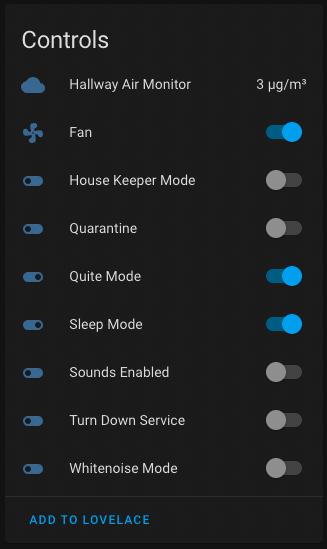
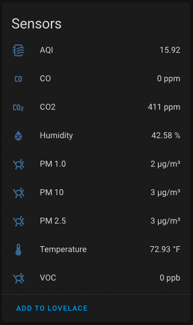
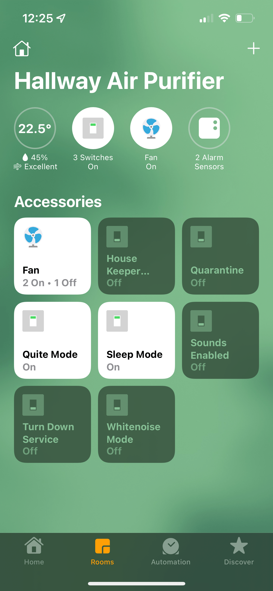

# HA-mila
  

**Integration for Mila Air Purifier in Home Assistant**

The [Mila Air Purifier](https://milacares.com/) is an air purifier which also has a number of air quality related sensors onboard.
[Home Assistant](https://www.home-assistant.io/) is an open source home automation package that puts local control and privacy first.
This integration leverages Mila's API to collects metrics and controls the air purifier devices as a fan in Home Assistant.

## Installation
### HACS Install

Go to HACS (Community). Select *Integrations* and click the + to add a new integration repository. Search for `HA-mila` to find this repository, select it and install.

Restart Home Assistant after installation.

### Manual Install
Copy the `mila` folder inside `custom_components` to your Home Assistant's `custom_components` folder.

Restart Home Assistant after copying.

### Setup
After restarting go to *Configuration*, *Integrations*, click the + to add a new integration and find the Mila integration to set up.

Log in with your Milacares account.

The integration will detect all air purifier devices registered to your account. Each device will expose a fan, air quality, switches and other related sensors. These can be added to your Lovelace UI using any component that supports it. By default your entity's name will correspond to the name of the Air Purifier device, which results in the entity `fan.hallway_air_purifier` being created. You can override the name and entity ID in Home Assistant's entity settings.

## Integration

### Google Assistant, Alexa, Homekit
> Note: Mila has official support for Google Home and Alexa. See [support](https://milacares.com/support.html#amazon-alexa).

You can easily expose the relevant entities through Home Assistant's integration for Google Assistant, Alexa or Homekit.

e.g. For Google Assistant - See [configured manually](https://www.home-assistant.io/integrations/google_assistant/) or via [Nabu Casa](https://www.nabucasa.com/config/google_assistant/) - you can expose a Fan entity and control it via Google.

For example, you can say:
*"Hey Google, turn on (device name)."*
*"Hey Google, stop (device name)."*
*"Hey Google, turn off (device name)."*

#### HomeKit

Since Mila doesn't yet have an integration for Homekit, you can easily create a homekit bridge from Home Assistant and expose the relevant entities for Apple Home. See more screenshots under **images**.

## Mila API
Mila has a REST API that their mobile apps run on. Here is a scratchpad that interacts with some of these API endpoints - [Gist](https://gist.github.com/sanghviharshit/913d14b225399e0fa4211b3e785671aa)

# TODO List

* oAuth token expiry logic in config flow
* Better exception handling
* config flow handler for options (save api response, timeout, scan interval)
* Preset Modes for fan
* Map app converts percentage to fan RPM non-linearly. Add this conversion logic to API
* Add some missing binary sensors
* Enable user input for night time start/end
* Add extra attributes to fan entity (whitenoise mode, sleep mode, etc.)
